# anomalykit

Industrial Anomaly Detection & Predictive Analytics Library.

A domain-agnostic Python library for multivariate anomaly detection, remaining useful life prediction, time series forecasting, operating mode clustering, multi-criteria ranking, and operational risk scoring.

## Models

| Module | Class | Description |
|--------|-------|-------------|
| **anomaly** | `IsolationForestDetector` | Multivariate anomaly detection using sklearn Isolation Forest with permutation-based feature importance and contribution estimation |
| **anomaly** | `MultiSensorPatternDetector` | Sliding-window pattern matching across correlated sensors with baseline correlation tracking |
| **anomaly** | `SensorFusionDetector` | PCA-based sensor fusion that detects anomalies via reconstruction error |
| **anomaly** | `CrossCorrelationAnalyzer` | Detects broken or shifted correlations between sensor pairs with optimal lag estimation |
| **anomaly** | `ContextualDetector` | Context-aware anomaly detection conditioned on operating mode (per-mode Isolation Forest / LOF) |
| **anomaly** | `AdaptiveThresholdEngine` | Per-asset, per-tag adaptive thresholds using Exponential Moving Average (EMA) |
| **rul** | `WeibullRULPredictor` | Remaining Useful Life prediction using Weibull distribution with censored data support |
| **forecast** | `ProphetForecaster` | Time series forecasting with Facebook Prophet (auto-fallback to linear trend + seasonality) |
| **cluster** | `AssetBehaviorClassifier` | KMeans-based behavioral clustering with rule-based fallback (liner, tramp, fishing, dark, etc.) |
| **cluster** | `OperatingModeClusterer` | Automatic operating mode identification via KMeans with transition matrix analysis |
| **ranking** | `TopsisRanker` | Multi-criteria TOPSIS ranking with configurable weights and benefit/cost criteria |
| **risk** | `OperationalRiskScorer` | Multi-dimensional risk aggregation (equipment, weather, crew, compliance, route) with risk matrix |

## Architecture

```mermaid
graph TD
    subgraph anomalykit
        subgraph Anomaly Detection
            IF[IsolationForestDetector]
            MS[MultiSensorPatternDetector]
            SF[SensorFusionDetector]
            CC[CrossCorrelationAnalyzer]
            CD[ContextualDetector]
            AT[AdaptiveThresholdEngine]
        end

        subgraph Predictive
            WB[WeibullRULPredictor]
            PF[ProphetForecaster]
        end

        subgraph Clustering
            BC[AssetBehaviorClassifier]
            OM[OperatingModeClusterer]
        end

        subgraph Scoring
            TR[TopsisRanker]
            RS[OperationalRiskScorer]
        end
    end

    DATA[Sensor/Telemetry Data] --> IF
    DATA --> MS
    DATA --> SF
    DATA --> CC
    DATA --> CD
    DATA --> AT

    HIST[Historical Failure Data] --> WB
    TS[Time Series Data] --> PF

    FEAT[Asset Feature Vectors] --> BC
    OPS[Operational Parameters] --> OM

    KPI[KPI Metrics] --> TR
    RISK_IN[Risk Dimensions] --> RS
```



## Tech Stack

- **Python** >= 3.10
- **NumPy** - array operations, linear algebra
- **SciPy** - Weibull fitting, cross-correlation, numerical integration, optimization
- **scikit-learn** - Isolation Forest, LOF, KMeans, PCA, StandardScaler, silhouette score
- **pandas** - DataFrames, time series handling
- **Prophet** (optional) - Facebook Prophet time series forecasting

## Installation

```bash
# Core (no Prophet dependency)
pip install -e .

# With Prophet support
pip install -e ".[forecast]"

# With dev tools
pip install -e ".[dev]"
```

## Quick Start

```python
import numpy as np
import pandas as pd
from anomalykit import IsolationForestDetector, AdaptiveThresholdEngine, WeibullRULPredictor

# Anomaly detection
data = pd.DataFrame(np.random.randn(1000, 4), columns=["temp", "pressure", "vibration", "flow"])
detector = IsolationForestDetector(contamination=0.05)
detector.fit(data)
result = detector.detect(data)
print(f"Found {result.anomaly_mask.sum()} anomalies")

# Adaptive thresholds
engine = AdaptiveThresholdEngine(k_factor=3.0)
result = engine.calculate(data, ["temp", "pressure"], asset_id="pump-01")
print(f"Violations: {result.violation_count}")

# RUL prediction
times_to_failure = np.array([1200, 1500, 1100, 1800, 1350, 1600, 1250, 1450])
predictor = WeibullRULPredictor().fit(times_to_failure)
rul = predictor.predict(current_hours=800)
print(f"Predicted RUL: {rul.predicted_rul:.0f} hours (survival: {rul.survival_probability:.1%})")
```

## Examples & Notebooks

Interactive Jupyter notebooks demonstrating every module with synthetic data:

| Notebook | Description |
|----------|-------------|
| [`01_anomaly_detection.ipynb`](examples/01_anomaly_detection.ipynb) | IsolationForest, MultiSensorPattern, and AdaptiveThreshold detectors on multi-sensor time series with injected spikes, drift, and stuck-sensor anomalies |
| [`02_remaining_useful_life.ipynb`](examples/02_remaining_useful_life.ipynb) | Weibull RUL prediction with censored failure data - survival curves, hazard rates, and confidence intervals |
| [`03_fleet_ranking.ipynb`](examples/03_fleet_ranking.ipynb) | TOPSIS multi-criteria ranking and OperationalRiskScorer with sensitivity analysis across weight configurations |
| [`04_forecasting.ipynb`](examples/04_forecasting.ipynb) | ProphetForecaster on daily time series with trend + seasonality - 30-day forecast with confidence bands and decomposition |
| [`05_benchmarks.ipynb`](examples/05_benchmarks.ipynb) | Performance benchmarks for all models - fit/predict time, memory usage, precision/recall comparison |

```bash
# Install example dependencies
pip install -e ".[examples]"

# Run notebooks
cd examples
jupyter notebook
```

Data is generated on the fly by `examples/generate_data.py` - no CSV files stored.

## Testing

```bash
# Run all tests
pytest tests/ -v

# With coverage
pytest tests/ --cov=anomalykit --cov-report=term-missing
```

## Limitations

- Models are standalone and stateless between calls - no built-in drift detection or online learning.
- `ProphetForecaster` falls back to linear trend + daily seasonality when Prophet is not installed. Fallback results are not comparable to full Prophet forecasts.
- `OperationalRiskScorer` requires explicit dimension inputs - it does not infer risk from raw sensor data.
- Anomaly scores are normalized per-batch and not calibrated across runs. Do not compare scores between different datasets.
- `AssetBehaviorClassifier` uses rule-based fallback when no pre-trained model bundle is available. Fallback results are marked with `cluster_id=-1`.

## Release Status

**0.1.0** - API is stabilising but not yet frozen. Minor versions may include breaking changes until `1.0.0`.

---

## License

MIT - see [LICENSE](./LICENSE)
